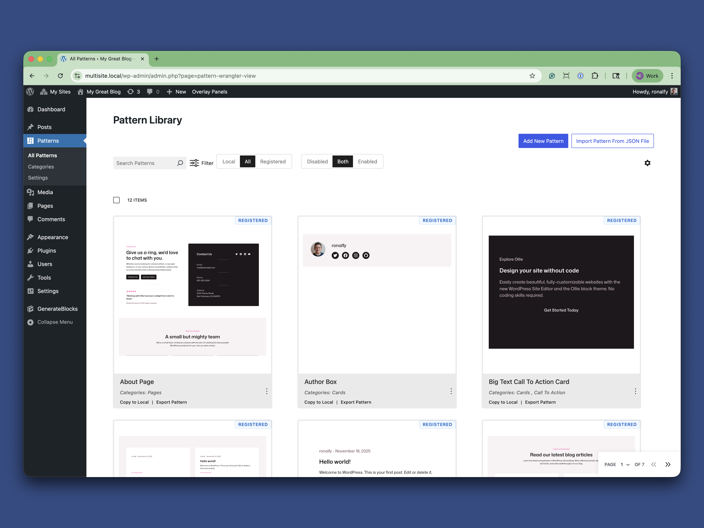
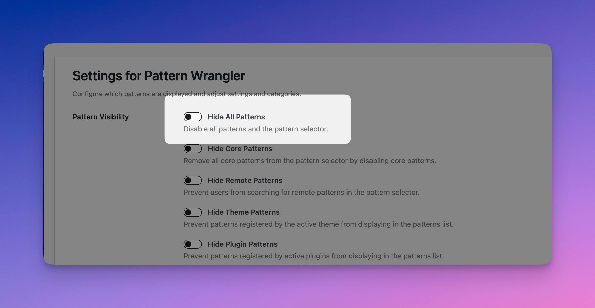
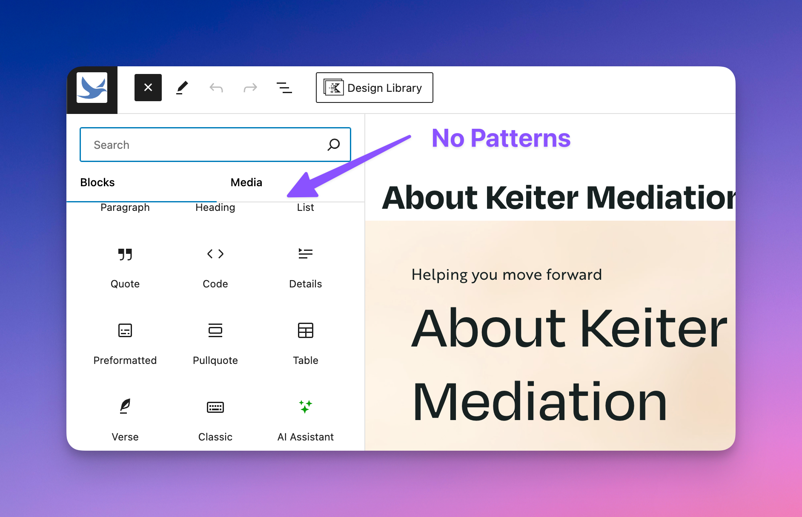
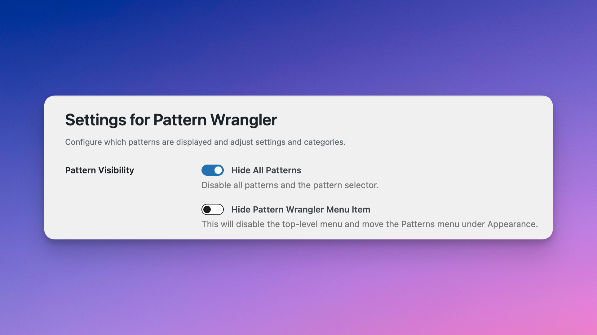
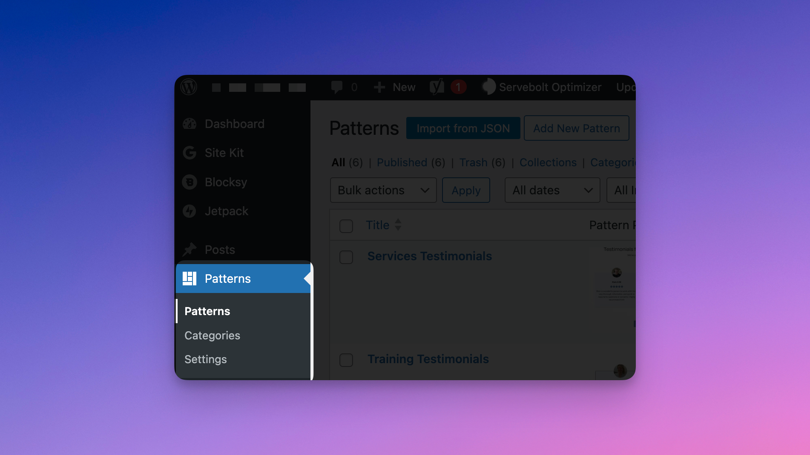
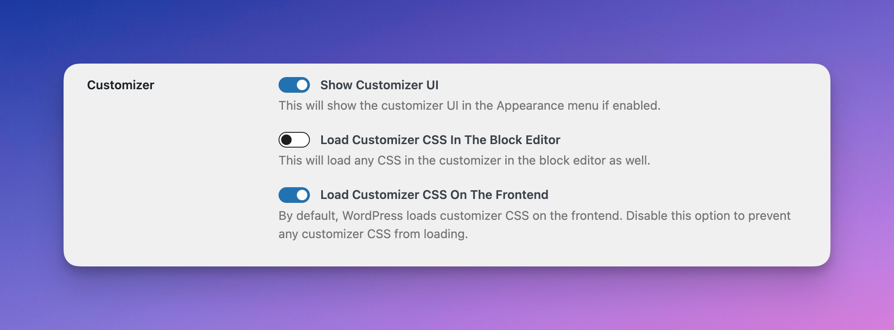
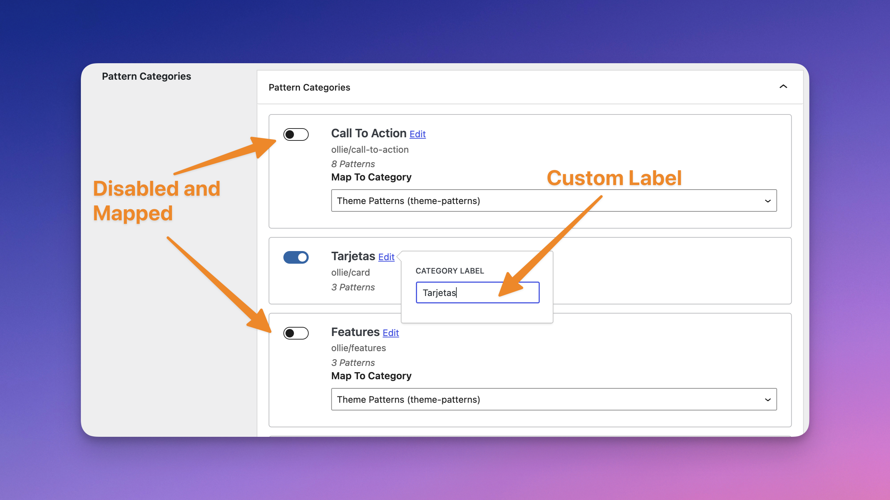
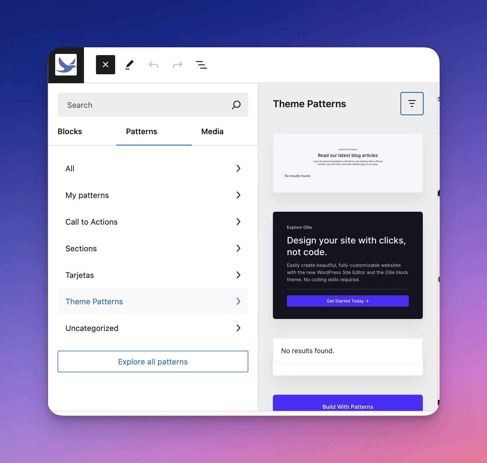
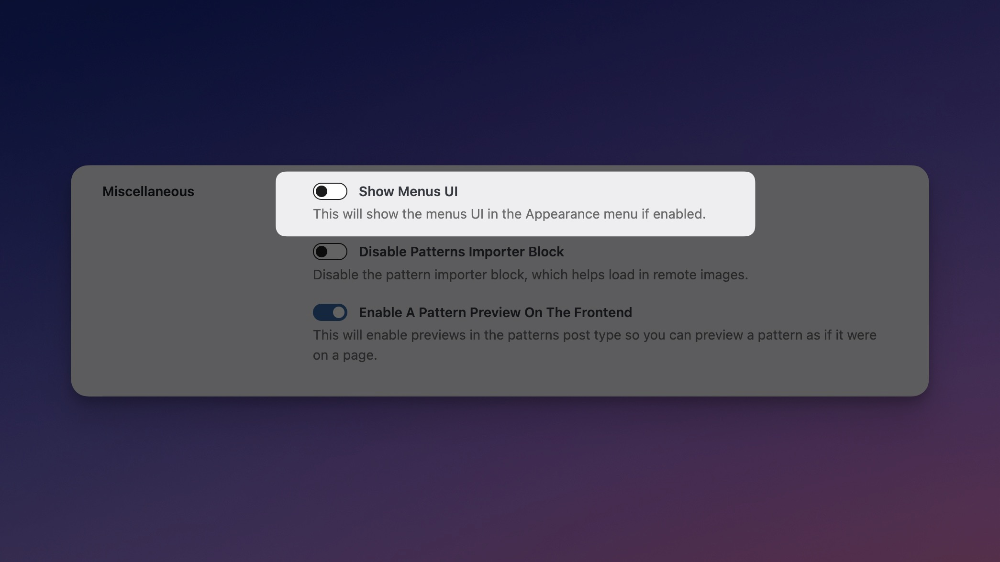

# Welcome to Pattern Wrangler

<figure><figcaption>
Main Patterns Screen in Pattern Wrangler
</figcaption></figure>

Pattern Wrangler helps you manage and deal with block patterns. Whether you love or hate block patterns, this plugin should provide a useful addition to your WordPress plugin arsenal.

<figure><figcaption>
Pattern Wrangler Quick Demo
</figcaption></figure>


[Pattern Wrangler is Free on WordPress.org](https://wordpress.org/plugins/pattern-wrangler/).



Pattern Wrangler is Open Source, Free, and on GitHub


Let's go over the major features.

### Hide All Patterns

<figure><figcaption>
Hide All Patterns in the Pattern Wrangler Settings
</figcaption></figure>

Hide all patterns with just one toggle.

<figure><figcaption>
No Patterns in the Block Inserter Screen
</figcaption></figure>

If you decide to hide all patterns, you can also hide the Pattern Wrangler settings under the Appearance tab.

<figure><figcaption>
Hide Pattern Wrangler Menu Item
</figcaption></figure>

### Hide Core and Remote Patterns

<figure><figcaption>
Default Patterns View in WordPress
</figcaption></figure>

By default, WordPress allows Core and remote patterns. Core patterns are patterns that come with WordPress itself. Remote patterns are those that come in the [Block Pattern Directory](https://wordpress.org/patterns/).

<figure><figcaption>
Hide Core and Remote Patterns
</figcaption></figure>

Disabling Core patterns will remove a large number of patterns and categories, which should make things easier to manage.

<figure><figcaption>
Core and Remote Patterns Disabled
</figcaption></figure>

Disable remote patterns if you don't want anyone accidentally installing a third-party pattern or a pattern that doesn't meet the design. Remote patterns can also significantly slow down the pattern search in terms of loading.

### Patterns are Front and Center

<figure><figcaption>
Patterns Top-level Menu Item
</figcaption></figure>

Upon activation, you'll notice the Patterns menu is now under the Posts menu item in the admin. Beneath that are pattern categories, and the settings for this plugin.


[finding-the-plugins-settings.md](getting-started/finding-the-plugins-settings.md)


Patterns are a slightly hidden post type by default (they are stashed under Appearance in classic themes). Pattern categories are totally hidden and only exposed if you know the direct URL.

A top-level item was chosen so that the categories and settings could live right next to the patterns.

For those who choose to hide all patterns, you can still hide the Pattern Wrangler settings under Appearance, which is where the original Patterns menu item lived prior to plugin activation.

In Block themes, the Patterns menu item is completely hidden but linked to in the Full-site Editor. Like pattern categories, these are totally hidden unless you know the direct URL.

### Enhanced Patterns View

<figure><figcaption>
Enhanced Patterns View in Pattern Wrangler
</figcaption></figure>

The Enhanced Patterns View lets you view all available patterns on your site at a glance.

* Sort between Local and Registered patterns.
* Filter between categories and pattern source.
* Click a pattern to view a real-time preview in a lightbox.
* Copy registered patterns to a local copy.
* Export all patterns to JSON.
* Copy a pattern to the clipboard.
* Disable each pattern individually.
* Quickly edit local patterns.
* Add new patterns or import patterns from JSON.

### Frontend Pattern Previews

<figure><figcaption>
Frontend Pattern Preview Button
</figcaption></figure>

Preview what a pattern will look like on the frontend.

For those not using block themes, authoring patterns involve a lot of trial and error in coordinating the block editor's appearance with the actual frontend appearance.

The default pattern experience doesn't provide a preview, so we've added one. It also works well with block themes.

Behind the scenes, we're loading most of the theme's styles, but trying to preserve the pattern's layout and structure. It should provide a close approximation of how a pattern will behave when inserted or displayed on your site.

For security reasons, only those with `publish_posts` Permissions can preview patterns.

### Hide Theme or Plugin Patterns

<figure><figcaption>
Hide Patterns Coming From Your Theme or Plugins
</figcaption></figure>

If you've installed a theme and don't fancy its patterns, that's fine. You can disable them.

If you prefer patterns not come from any plugins, such as WooCommerce, you can disable them here as well.

### Re-enabling the Customizer With Full-site Editing

<figure><figcaption>
Customizer Options in Pattern Wrangler
</figcaption></figure>

Breaking up with the customizer is difficult, even when using a block theme. With Pattern Wrangler, you can re-enable the customizer menu item, and it will show up where it did before under Appearance.


Disabling the Customizer UI in the settings does not remove the Customizer UI in classic themes.


<figure><figcaption>
Customizer + Editor
</figcaption></figure>

The customizer still has a lot of useful items that are often easier to grab than dive into full-site editing land.

### The Customizer and Block Editor CSS

The customizer is also useful for quickly solving CSS issues with blocks.

The customizer has an Additional CSS field, which we are reluctant fans of.

<figure><figcaption>
CSS in the Customizer
</figcaption></figure>

Additional CSS is a popular feature, and it's even present in FSE (Block) themes in the styles panel.

<figure><figcaption>
Styles Panel in FSE (Block) Themes
</figcaption></figure> <figure><figcaption>
Additional CSS in Styles Panel in FSE (Block) Themes
</figcaption></figure>

Troubleshooting CSS issues on the front end with blocks is no picnic, and the customizer CSS can often provide temporary fixes until a more permanent fix is implemented. Since customizer CSS doesn't load in the admin, any frontend block fixes will not be reflected in the admin.

With Pattern Wrangler, you can enable the customizer and have it load CSS in the block editor. This means that you can use the customizer CSS as a block stylesheet for both the front end and admin.

If you disable the customizer CSS on the front end, you can technically have a block-editor-only stylesheet without the need to code a block plugin.

### Disabling the Customizer CSS on the Frontend

Through our tests, we've found that the customizer CSS on the front end can slow things down quite a bit, particularly as the CSS is rendered and takes up space in the document size.

If you're not using the customizer's Additional CSS section, you can safely disable customizer CSS and possibly receive some performance gains.

As mentioned, the Customizer CSS can be used as a temporary fix until something more permanent can be implemented, so keep this in mind when disabling this option.

### Copy Patterns From Site to Site With the Pattern Importer Block

If you have a pattern on one site and need to transfer it to another, there's a Pattern Importer block available that'll automatically download any remote images.

<figure><figcaption>
Stress Test Importing a Pattern with 69 images.
</figcaption></figure>

This can allow you to transfer guest posts from site to site. Or bring a production pattern down locally, along with the images.

The Pattern Importer block also natively integrates with the popular layout builder [GenerateBlocks](https://wordpress.org/plugins/generateblocks/) (freemium).


GenerateBlocks is an incredibly easy and powerful layout builder for the block editor


### Manage and Map Registered Categories

Registered categories are categories registered by WordPress Core, your theme, or your plugins. These are added programmatically, as opposed to creating your own pattern category in the admin.

With Pattern Wrangler, you can disable, map, and rename these registered categories.

<figure><figcaption>
Registered Categories Can be Disabled, Renamed, and Mapped
</figcaption></figure>

One use case of mapping is consolidating all of a theme's patterns into just one category or selectively disabling categories.

The result can be a much more organized a streamlined pattern experience with the available categories.

<figure><figcaption>
An Example of a Translated and Organized Pattern Section
</figcaption></figure>

### Re-enable Menus in Full-site Editing (Block) Themes

<figure><figcaption></figcaption></figure>

With Block themes, there is no need for the Menus menu item as there is a navigation block that does similar things. However, creating menus in the navigation block is quite tedious, and some are more comfortable creating menus the old-fashioned way.

Just note that once you create the navigation block and select the menu, your menu will not be synced with the core menu again.&#x20;

This feature is useful for quickly creating a menu, importing it into the navigation block, and disabling it again.
