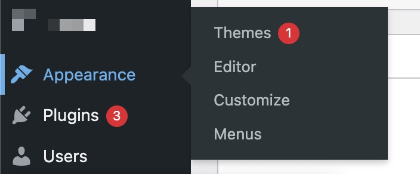
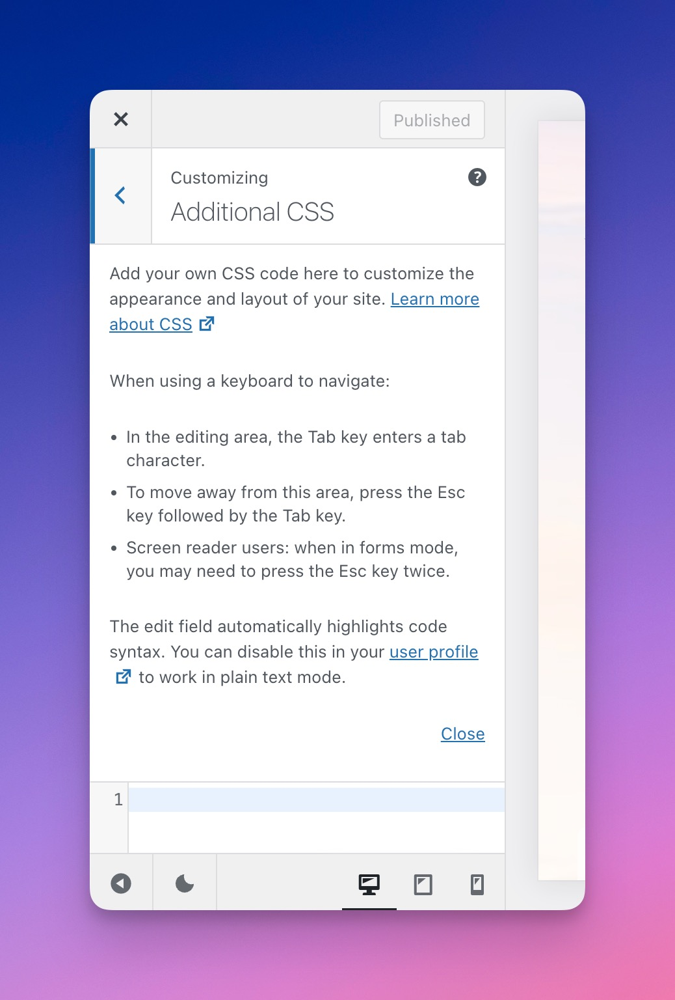
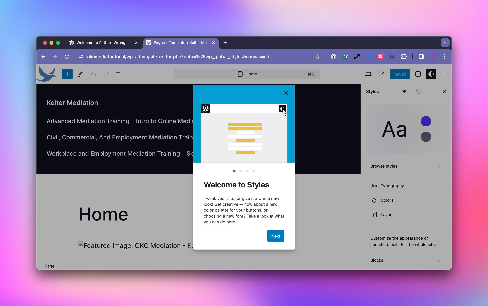
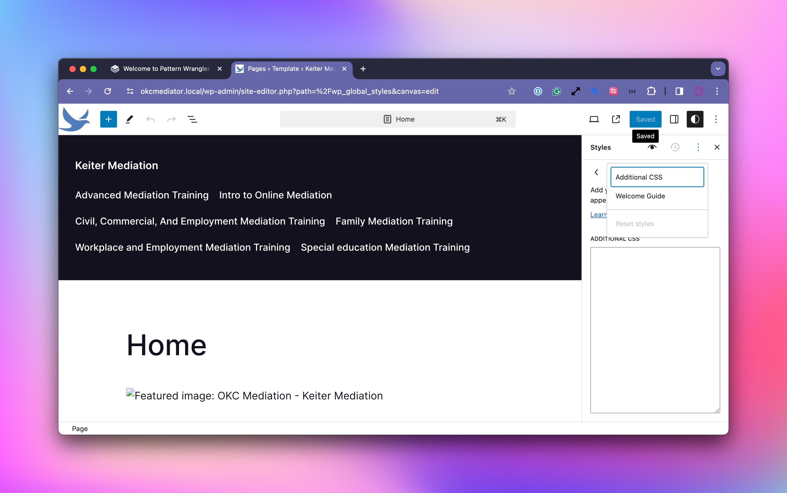

# Control the Customizer, Menus, and Customizer CSS

<figure><figcaption>
Customizer Options in Pattern Wrangler
</figcaption></figure>

Breaking up with the customizer is difficult, even when using a block theme. With Pattern Wrangler, you can re-enable the customizer menu item, and it will appear where it did before, under Appearance.


Disabling the Customizer UI in the settings does not remove the Customizer UI in classic themes.


<figure><figcaption>
Customizer + Editor
</figcaption></figure>

The customizer still has a lot of useful items that are often easier to grab than dive into full-site editing land.

### The Customizer and Block Editor CSS

The customizer is also useful for quickly solving CSS issues with blocks.

The customizer has an Additional CSS field, which we are reluctant fans of.

<figure><figcaption>
CSS in the Customizer
</figcaption></figure>

Additional CSS is a popular feature, and it's even present in FSE (Block) themes in the styles panel.

<figure><figcaption>
Styles Panel in FSE (Block) Themes
</figcaption></figure> <figure><figcaption>
Additional CSS in Styles Panel in FSE (Block) Themes
</figcaption></figure>

Troubleshooting CSS issues on the front end with blocks is no picnic, and the customizer CSS can often provide temporary fixes until a more permanent fix is implemented. Since customizer CSS doesn't load in the admin, any frontend block fixes will not be reflected in the admin.

With Pattern Wrangler, you can enable the customizer and have it load CSS in the block editor. This means that you can use the customizer CSS as a block stylesheet for both the front end and admin.

If you disable the customizer CSS on the front end, you can technically have a block-editor-only stylesheet without the need to code a block plugin.

### Disabling the Customizer CSS on the Frontend

Through our tests, we've found that the customizer CSS on the front end can slow things down quite a bit, particularly as the CSS is rendered and takes up space in the document size.

If you're not using the customizer's Additional CSS section, you can safely disable customizer CSS and possibly receive some performance gains.

As mentioned, the Customizer CSS can be used as a temporary fix until something more permanent can be implemented, so keep this in mind when disabling this option.

### Re-enable Menus in Full-site Editing (Block) Themes

<figure><figcaption>
Show Menu Option in the Admin Settings
</figcaption></figure>

With Block themes, there is no need for the Menus menu item, as there is a navigation block that does similar things. However, creating menus in the navigation block is quite tedious, and some are more comfortable creating menus the old-fashioned way.

Just note that once you create the navigation block and select the menu, your menu will not be synced with the core menu again.&#x20;

This feature is useful for quickly creating a menu, importing it into the navigation block, and disabling it again.
