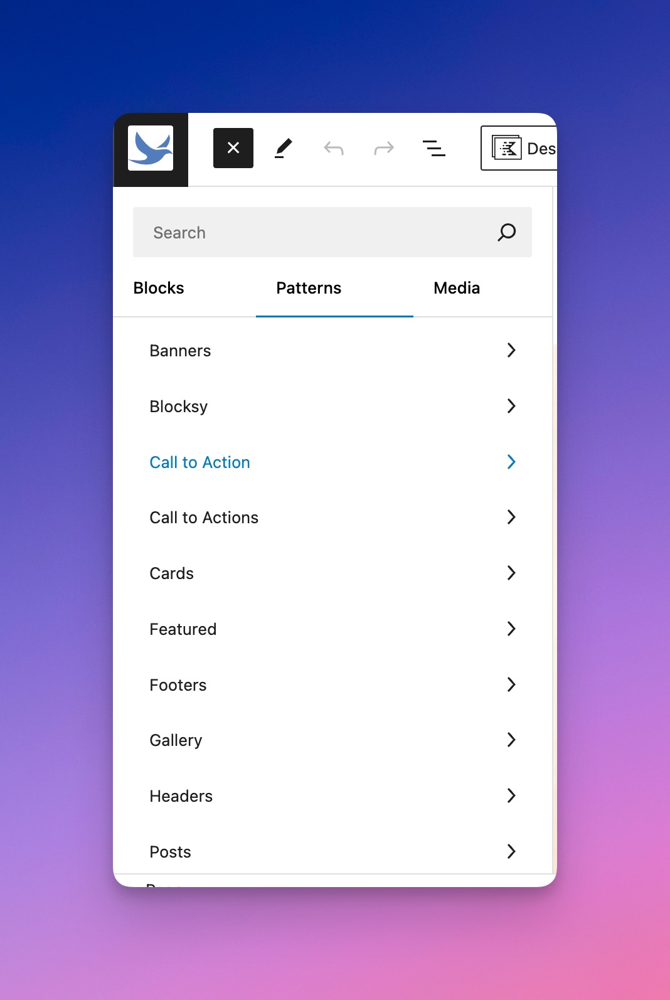
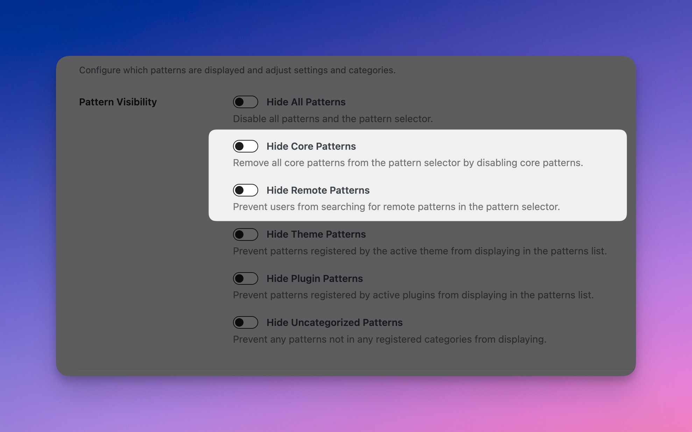
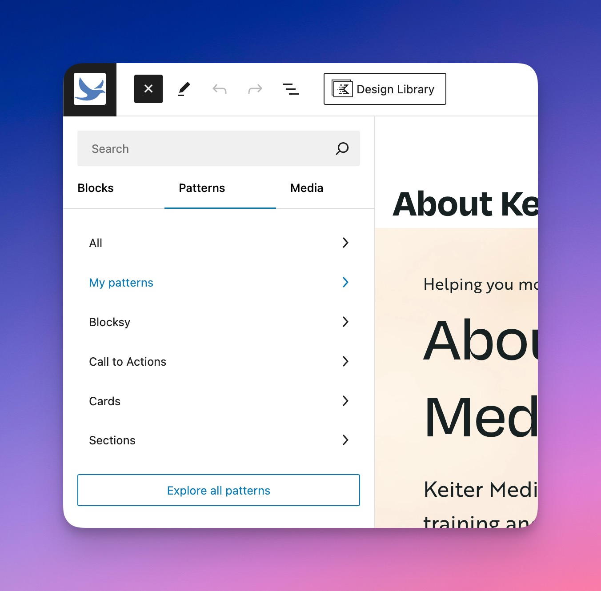
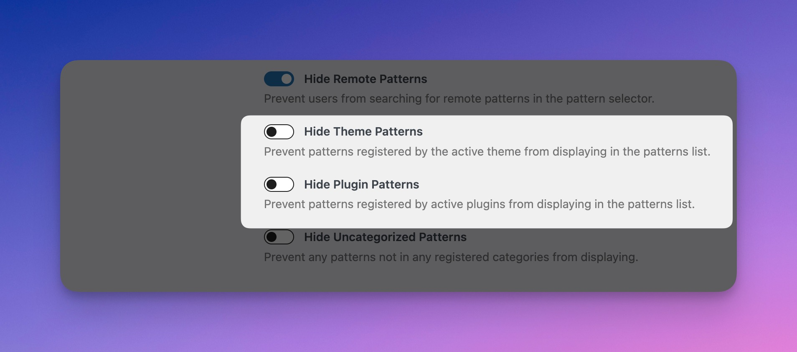

# Hide and Disable Patterns

Quickly hide all patterns or prevent them from loading from WordPress Core, remotely via the Patterns Library, from a specific registered category, or from a plugin or theme.

### Hide All Patterns

<figure><figcaption>
Hide All Patterns in the Pattern Wrangler Settings
</figcaption></figure>

Hide all patterns with just one toggle.

<figure><figcaption></figcaption></figure>

If you decide to hide all patterns, you can also hide the Pattern Wrangler settings under the Appearance tab.

<figure><figcaption>
Hide Pattern Wrangler Menu Item
</figcaption></figure>

### Hide Core and Remote Patterns

<figure><figcaption>
Default Patterns View in WordPress
</figcaption></figure>

By default, WordPress allows Core and remote patterns. Core patterns are patterns that come with WordPress itself. Remote patterns are those that come in the [Block Pattern Directory](https://wordpress.org/patterns/).

<figure><figcaption>
Hide Core and Remote Patterns
</figcaption></figure>

Disabling Core patterns will remove a large number of patterns and categories, which should make things easier to manage.

<figure><figcaption>
Core and Remote Patterns Disabled
</figcaption></figure>

Disable remote patterns if you don't want anyone accidentally installing a third-party pattern or a pattern that doesn't meet the design. Remote patterns can also significantly slow down the pattern search in terms of loading.

### Hide Theme or Plugin Patterns

<figure><figcaption>
Hide Patterns Coming From Your Theme or Plugins
</figcaption></figure>

If you've installed a theme and don't fancy its patterns, that's fine. You can disable them.

If you prefer patterns not come from any plugins, such as WooCommerce, you can disable them here as well.
